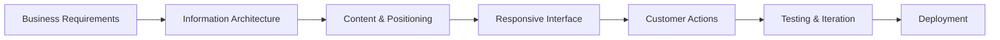

# Company Website Delivery — Case Study

## Executive summary

A business website project focused on translating a company's service proposition into a clearer public-facing digital experience.

The work covered information structure, page hierarchy, visual presentation, responsive behaviour, customer access and deployment.

## The business problem

A company website has to do more than look polished. It has to answer, quickly:

- What does the company do?
- Who is it for?
- Why should someone trust it?
- What should a visitor do next?
- Does the experience remain usable on a phone?

The project therefore treated the website as part of the business operating funnel, not simply as a visual brochure.

## My contribution

I worked across:

- page and information architecture;
- content positioning;
- visual layout;
- responsive implementation;
- customer access / booking flow;
- deployment;
- iteration based on presentation and usability.

## Delivery model

## Core considerations

### Positioning

The page structure needs to make the business proposition understandable before asking the visitor to take action.

### Information hierarchy

Important content should be discoverable without forcing visitors through unnecessarily long or confusing navigation.

### Responsive behaviour

The website needs to preserve hierarchy and usability across desktop and mobile layouts.

### Customer actions

Calls to action, enquiries and booking pathways should be integrated into the experience rather than added as an afterthought.

## Public evidence

The repository contains desktop/mobile screenshots showing the delivered interface, including home and property views.

## What this project demonstrates

**business requirement → digital positioning → information architecture → responsive build → customer access → deployment**

It demonstrates practical digital delivery: understanding the business requirement, turning it into a customer-facing structure, implementing the experience and getting it into use.

## Public / private boundary

The repository is a case study. Production-only assets and implementation details are kept separate where they are associated with live business systems.

---

[Back to my portfolio](https://Nandwa254.github.io/)
